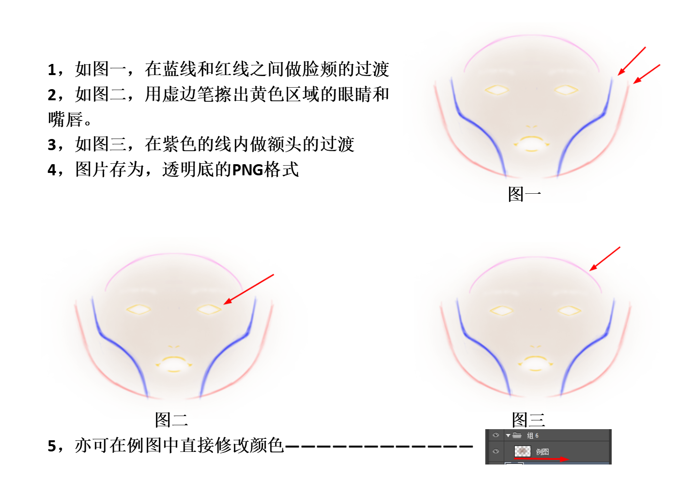

# Light Makeup bundle Parameter Description

## Content

[TOC]


## Function Documentation

Light makeup is the combination of makeup and beauty. The use of light make-up effect makes the beauty effect better. For the use of beauty, please refer to ** beauty props function document **. The use of make-up function is described below.

## Parameter Description

### Light Makeup Parameters

The following parameters are some switches and degree parameters of light beauty, which can be set through the**fuItemSetParam**interface:

```
	is_makeup_on:	1,     //makeup switch
	makeup_intensity:1.0,       //makeup intensity
	//The following is a separate parameter for each makeup. Setting intensity to 0 is to turn off this make-up effect
	makeup_intensity_lip:1.0,		//kouhong
	makeup_intensity_pupil:1.0,		//meitong
	makeup_intensity_eye:1.0,  		//yanying
	makeup_intensity_eyeLiner:1.0,  		//yanxian
	makeup_intensity_eyelash:1.0,  		//jiemao
	makeup_intensity_eyeBrow:1.0,  		//meimao
	makeup_intensity_blusher：1.0,     //saihong
	makeup_lip_color：[0,0,0,0]   //Array of length 4, rgba color value
	makeup_lip_mask：0.0        //Lip optimization effect switch, 1.0 is on, 0 is off
```

### Texture Input

**Note: the following interfaces are used after 5.8**

Use the **fuCreateTexForItem**interface to directly pass in image data in the interface

```
fuCreateTexForItem(int obj_handle,__pointer name,__pointer value,int width,int height)
```

**obj_handle** bundleID corresponding to beauty bundle

**name** You can take the following values

```
tex_brow eyebrow
tex_eye eyeshadow
tex_pupil pupil
tex_eyeLash eyelash
tex_highlight lipstick hightlight
tex_eyeLiner eyeliner
tex_blusher blusher
```

**value** Corresponding to an array of type u8, corresponding to the image rgba8 data

**width** and **height** Corresponding to picture width and height

### landmark modification

The values of landmark related parameters are also set through the **fuItemSetParam** interface:

```
The main purpose of landmark modification is to edit the feature points of beauty use and optimize the effect.
The modification of landmark is mainly controlled by two parameters. The students in the client need to set these two parameters to modify and use landmark: 
1. is_use_fix：this parameter controls whether the modified landmark point is used. If it is set to 1, it is used and 0 is not used
2. fix_makeup_data：this parameter is an array. The client needs to pass in an array. The length of the passed array is 150 * number of faces, that is, all the point information is passed in the array stored.

```

#### Note：

The reason why the length of fix_makeup_data is 150 is that we return a total of 75 landmarks, each of which has x and Y data, so it is 75 * 2 = 150


## Appendix

### Recommended material combination of light beauty

The following material combination is the combination of recommended makeup material and filter. The parameters of makeup and filter have been given, and it is recommended to use.

| Makeup   | makeup parameters |  lipstick      | lipstick parameters | blush        | blush parameters | eyebrow          | eyebrow parameters | eye shadow            | eye shadow parameters |  filter names & parameters | filter parameters |
| :----- | :------- | :-------- | :------- | :---------- | :------- | :------------ | :------- | :-------------- | :------- | :------------ | :------- |
| Peach blossom makeup | 90       | mu_lip_01 | 90       | mu_blush_01 | 90       | mu_eyebrow_01 | 50       | mu_eyeshadow_01 | 90       | fennen3       | 100      |
| Retro makeup | 100      | mu_lip_11 | 100      | mu_blush_14 | 100      | mu_eyebrow_11 | 50       | mu_eyeshadow_11 | 100      | lengsediao11  | 85       |
| Punk makeup | 85       | mu_lip_03 | 85       |             | 0        | mu_eyebrow_03 | 50       | mu_eyeshadow_03 | 85       | bailiang4     | 50       |
| maple leaves makeup | 100      | mu_lip_10 | 100      | mu_blush_13 | 100      | mu_eyebrow_10 | 50       | mu_eyeshadow_10 | 100      | bailiang3     | 80       |
| Koi fish makeup | 90       | mu_lip_12 | 90       | mu_blush_15 | 90       | mu_eyebrow_12 | 50       | mu_eyeshadow_12 | 90       | fennen2       | 70       |
| Plum makeup | 85       | mu_lip_13 | 85       | mu_blush_16 | 85       | mu_eyebrow_13 | 50       | mu_eyeshadow_13 | 85       | nuansediao2   | 80       |
| hangover makeup | 100      | mu_lip_14 | 100      | mu_blush_17 | 100      | mu_eyebrow_14 | 50       | mu_eyeshadow_14 | 100      | fennen8       | 55       |
| Red tea makeup | 100      | mu_lip_16 | 90       | mu_blush_18 | 100      | mu_eyebrow_10 | 60       | mu_eyeshadow_16 | 100      | xiaoqingxin2  | 75       |
| Winter makeup | 90       | mu_lip_17 | 90       | mu_blush_19 | 80       | mu_eyebrow_12 | 60       | mu_eyeshadow_17 | 80       | nuansediao1   | 80       |
| Boy friend makeup | 100      | mu_lip_18 | 100      | mu_blush_20 | 80       | mu_eyebrow_16 | 65       | mu_eyeshadow_18 | 90       | xiaoqingxin3  | 90       |
| cream makeup | 100      | mu_lip_19 | 75       | mu_blush_21 | 100      | mu_eyebrow_17 | 50       | mu_eyeshadow_19 | 95       | bailiang1     | 75       |
| Clear and transparent makeup| 90       | mu_lip_20 | 80       | mu_blush_22 | 90       | mu_eyebrow_18 | 45       | mu_eyeshadow_20 | 65       | xiaoqingxin1  | 80       |
| Grapefruit makeup | 100      | mu_lip_21 | 80       | mu_blush_23 | 100      | mu_eyebrow_19 | 60       | mu_eyeshadow_21 | 75       | lengsediao4   | 70       |
| World-weary makeup | 100      | mu_lip_22 | 80       | mu_blush_24 | 100      | mu_eyebrow_13 | 60       | mu_eyeshadow_22 | 100      | bailiang2     | 85       |
| black and white makeup | 100      | mu_lip_15 | 100      |             | 0        | mu_eyebrow_15 | 60       | mu_eyeshadow_15 | 100      | heibai1       | 100      |

### Foundation making

The foundation is made by blush, and the corresponding parameter is **tex_blusher**

The way to make foundation resources is as follows.

