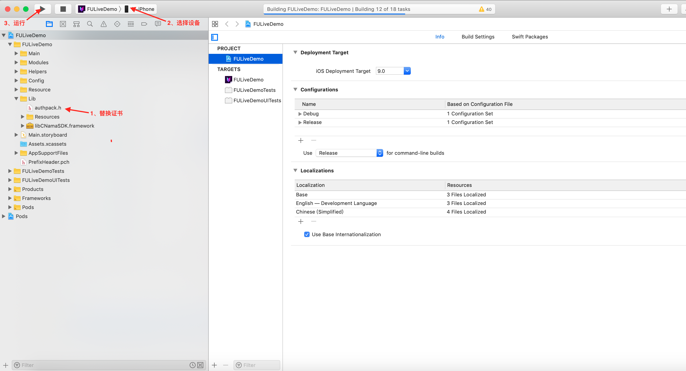

# Demo运行说明文档-iOS 

------

级别：Public   
更新日期：2021-02-15
SDK版本: 8.1.0

### 最新更新内容：

1）更新人脸检测模型为全角度,高端机可自由选择是否启动小人脸检测
2）更新PTA侧驱动相关接口
3）解决部分已知bug

------

级别：Public   
更新日期：2021-12-24 
SDK版本: 8.0.2

### 最新更新内容：

1）解决部分bug

------

级别：Public   
更新日期：2021-11-17 
SDK版本: 8.0.1

### 最新更新内容：

1）解决部分bug

------

级别：Public   
更新日期：2021-10-27 
SDK版本: 8.0.0

### 最新更新内容：

1）美颜特效优化，优化了磨皮、大眼、脸型等8大功能，对皮肤细节、轮廓线条、变形比例等多维度的效果进行提升
2）新增分机型适配策略，在高端机上使用效果更佳的均匀磨皮，中低端机上使用性能效果均衡的精细磨皮，提高整体设备的利用率
3）美妆优化，优化了口红、眉毛、睫毛、美瞳的自然度，新增了口红质地和风格组合妆
4）人脸检测算法优化，优化了检出率及误检率
5）人像分割算法优化，优化PC端半身场景下，分割准确性、分割边缘平滑度、背景误识别等问题
6）新增绿幕安全区域功能，支持根据模板对制定区域进行绿幕抠像，模板支持客户自定义
7）优化多个功能混用时的渲染时序问题
8）解决一些bug

------

级别：Public   
更新日期：2021-07-09 
SDK版本: 7.4.1

### 最新更新内容：

1）更新精品贴纸8款，包含2款PK游戏，5款装饰及互动贴纸，1款全身驱动道具
2）更新2款中国风Animoji模型
3）修复人像分割贴纸效果问题，修复后人像分割结果和贴纸效果会同时出现
4）修复一些bug，包括高分辨率磨皮效果问题，人脸检测与贴纸绘制的时序问题

------

级别：Public   
更新日期：2021-04-19 
SDK版本: 7.4.0  

------

### 最新更新内容：

2021-04-19  7.4.0更新说明
1）【Demo层】重构特效Demo，将面向过程变成改为面向对象，整体结构逻辑更清晰，客户调用更便捷。同时具有节省内存、优化itemID自动销毁逻辑、精简用户传入信息过程，低耦合性提高架构灵活度等多方优势
2）新增情绪识别功能，支持8种基本的饱满情绪检测
3）新增内容服务模块，展示游戏道具及精品贴纸，主要包括游戏类、情节类、头饰类、氛围类等丰富的特效道具
4）新增异步接口，改善用户在低端设备上帧率不足问题
5）优化美体性能，Android端帧率上升24%，iOS端耗时下降13%
6）优化人像分割性能，Andriod端帧率上升39%，iOS耗时下降39%
7）优化人像分割效果，主要包括优化缝隙问题，使人像分割更加贴合人体，不会有明显空隙；提升人体分割准确性，减少背景误识别情况
8）增加人像分割新玩法，开放用户自定义背景接口，便于用户快速换背景；支持人像描边玩法，可自定义描边的宽度、距离、颜色
9）增加Animoji无尾熊模型；优化Animoji面部驱动效果，提升驱动后模型的稳定性和灵敏度
10）优化美妆效果，主要包括唇部遮挡时口红不再显现；提升美瞳的贴合度；增加多款美瞳素材

------

### 最新更新内容：

**2021-1-25 v7.3.2:  **

- 优化人脸表情跟踪驱动性能。
- fuSetup 函数改为线程安全。
- fuSetUp 、fuCreateItemFromPackage、fuLoadAIModel函数增加异常处理，增强鲁棒性。
- 修复自定义哈哈镜功能效果问题。
- 修复SDK在Mac 10.11上crash问题。
- 修复SDK在贴纸和Animoji混用时crash问题。

------
### 目录：
本文档内容目录：

[TOC]

------
### 1. 简介 
本文档旨在说明如何将Faceunity Nama SDK的iOS Demo运行起来，体验Faceunity Nama SDK的功能。FULiveDemo 是集成了 Faceunity 面部跟踪、美颜、Animoji、道具贴纸、AR面具、表情识别、音乐滤镜、人像分割、手势识别、哈哈镜以及Avatar 捏脸功能的Demo。Demo将根据客户证书权限来控制用户可以使用哪些产品。

------
### 2. iOS Demo文件结构
本小节，描述iOS Demo文件结构，各个目录，以及重要文件的功能。

```obj
+FULiveDemo
  +FULiveDemo 			  	//原代码目录
    +Main                     //主模块(主页和公共页面UI、模型、主业务管理类) 
    +Modules                  //所有功能模块
      +Normal                   //普通道具模块
      +Beauty                   //美颜模块
        ...
    +Helpers                //主要业务管理类  
      -FUManager              //Nama业务管理类
      +VC                      //基类控制器
      +Manager                 //管理类基类
      	...   
    +Config					//配置文件目录
      -DataSource             //主界面，权限，item 道具配置类 
      -makeup.json       	  //美妆单个妆数组
      -makeup_whole.json      //美妆整体妆容配置
      -avatar.json            //捏脸颜色，模板配置文件
    +Resource               
       +itmes                 //各个模块道具资源 
    +Lib                    //nama SDK  
      -authpack.h             //权限文件
      -FURenderKit.framework   //动态库      
      +Resources               //各个能力相关的资源
  +docs						//文档目录
  +Pods                     //三方库管理
  -FULiveDemo.xcworkspace   //工程文件
  
```

------
### 3. 运行Demo 

#### 3.1 开发环境
##### 3.1.1 支持平台
```
iOS 9.0以上系统
```
##### 3.1.2 开发环境
```
Xcode 8或更高版本
```

#### 3.2 准备工作 
- [下载FULiveDemo](https://github.com/Faceunity/FULiveDemo)
- 替换证书文件 **authpack.h**，获取证书 见 **3.3.1**

#### 3.3 相关配置
##### 3.3.1 导入证书
您需要拥有我司颁发的证书才能使用我们的SDK的功能，获取证书方法：

1、拨打电话 **0571-89774660** 

2、发送邮件至 **marketing@faceunity.com** 进行咨询。

iOS端发放的证书为包含在authpack.h中的g_auth_package数组，如果您已经获取到鉴权证书，将authpack.h导入工程中即可。根据应用需求，鉴权数据也可以在运行时提供(如网络下载)，不过要注意证书泄露风险，防止证书被滥用。

#### 3.4 编译运行



------
### 4. 常见问题 

#### 4.1 运行报错

第一次运行Demo会报缺少证书的 error ,如果您已拥有我司颁发的证书，将证书替换到工程中重新运行即可。
