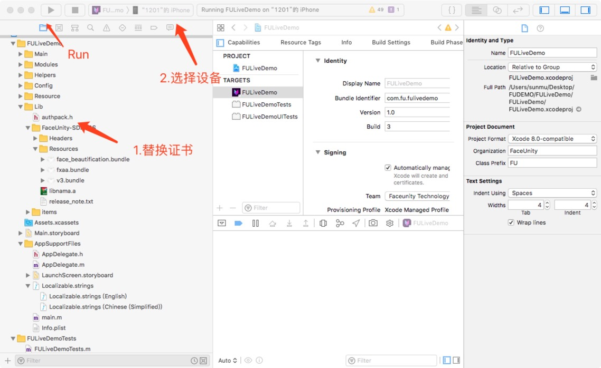

# Demo运行说明文档-iOS  
级别：Public   
更新日期：2020-03-19   
SDK版本: 6.7.0  

-------

**FaceUnity Nama SDK v6.7.0 (2020-03-19 )**

1. 美颜效果
      -新增去黑眼圈、去法令纹功能
      -优化磨皮效果，新增只磨皮人脸区域接口功能
      -优化原有美型效果

2. 优化表情跟踪效果，解决了6.6.0版表情系数表情灵活度问题——FaceProcessor模块优化
   -解决Animoji表情灵活度问题，基本与原有SDK v6.4.0效果相近
   -解决优化了表情动图的鼻子跟踪效果问题

3. 优化美妆效果，人脸点位优化，提高准确性
   -优化口红点位与效果，解决张嘴、正脸、低抬头、左右转头、抿嘴动作的口红溢色
   -优化美瞳点位效果，是美瞳效果稳定
   -腮红效果优化，解决了仰头角度下腮红强拉扯问题

4. 新增接口支持图像裁剪，解决瘦脸边缘变形问题（边缘变形剪裁）
5. 新增接口判断初始化完成状态
6. 移动端Demo优化曝光聚焦效果，效果达到市面上最优效果

------
### 目录：
本文档内容目录：

[TOC]

------
### 1. 简介 
本文档旨在说明如何将Faceunity Nama SDK的iOS Demo运行起来，体验Faceunity Nama SDK的功能。FULiveDemo 是集成了 Faceunity 面部跟踪、美颜、Animoji、道具贴纸、AR面具、换脸、表情识别、音乐滤镜、背景分割、手势识别、哈哈镜、人像驱动以及Avatar 捏脸功能的Demo。Demo将根据客户证书权限来控制用户可以使用哪些产品。

------
### 2. iOS Demo文件结构
本小节，描述iOS Demo文件结构，各个目录，以及重要文件的功能。

```
+FULiveDemo
  +FULiveDemo 			  	//原代码目录
    +Main                     //基类控制器(主要包含基类UI和视频采集) 
    +Modules                  //所有功能模块
      +Normal                   //普通道具模块
      +Beauty                   //美颜模块
        ...
    +Helpers                //主要业务管理类  
      -FUManager              //nama 业务类
      -FUCamera               //视频采集类     
    +Config					//配置文件目录
      -DataSource             //主界面，权限，item 道具配置类 
      -makeup.json       	  //美妆单个妆数组
      -makeup_whole.json      //美妆整体妆容配置
      -avatar.json            //捏脸颜色，模板配置文件
    +Lib                    //nama SDK  
      -authpack.h             //权限文件
      +FaceUnity-SDK-iOS      
        +Headers
          -funama.h                //C 接口
          -FURenderer.h            //OC 接口
        +Resources               //SDK 重要功能资源
        -libnama.a               //Nama图形库
        -libfuai.a               //Nama算法库
        +items                   //个个模块道具资源 
  +docs						//文档目录
  +Pods                     //三方库管理
  -FULiveDemo.xcworkspace   //工程文件
  
```

------
### 3. 运行Demo 

#### 3.1 开发环境
##### 3.1.1 支持平台
```
iOS 9.0以上系统
```
##### 3.1.2 开发环境
```
Xcode 8或更高版本
```

#### 3.2 准备工作 
- [下载FULiveDemo](https://github.com/Faceunity/FULiveDemo)
- 替换证书文件 **authpack.h**，获取证书 见 **3.3.1**

#### 3.3 相关配置
##### 3.3.1 导入证书
您需要拥有我司颁发的证书才能使用我们的SDK的功能，获取证书方法：

1、拨打电话 **0571-89774660** 

2、发送邮件至 **marketing@faceunity.com** 进行咨询。

iOS端发放的证书为包含在authpack.h中的g_auth_package数组，如果您已经获取到鉴权证书，将authpack.h导入工程中即可。根据应用需求，鉴权数据也可以在运行时提供(如网络下载)，不过要注意证书泄露风险，防止证书被滥用。

#### 3.4 编译运行



------
### 4. 常见问题 

#### 4.1 运行报错

第一次运行Demo会报缺少证书的 error ,如果您已拥有我司颁发的证书，将证书替换到工程中重新运行即可。

#### 4.2 工程找不到libnama.a

由于最新的含有深度学习的libnama.a大小已超过100M，我们没有上传libnama.a的原文件，只是上传了一个libnama.zip的文件，在你第一次编译工程的时候我们会解压libnama.zip。如果你想从工程目录中获取含有深度学习的libnama.a，并且你没有编译过工程的话，则需要先解压libnama.zip获得libnama.a才行。